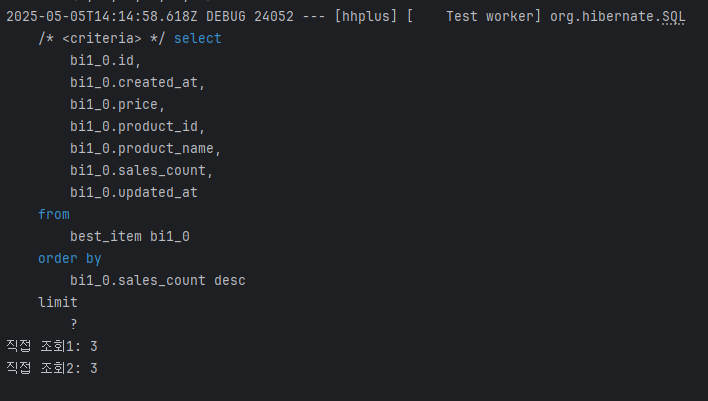
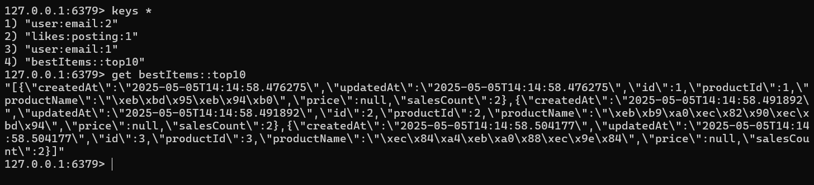
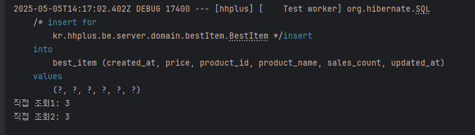

```java
    List<BestItem> items = bestItemService.getTop10BestItems();
    System.out.println("직접 조회1: " + items.size());
    List<BestItem> items2 = bestItemService.getTop10BestItems();
    System.out.println("직접 조회2: " + items2.size());
```


- 두번 조회시 한번만 조회하고 캐시에 적재한다.
- 레디스 조회

- 이후 캐시에서 조회 (조회쿼리 없음)
- 