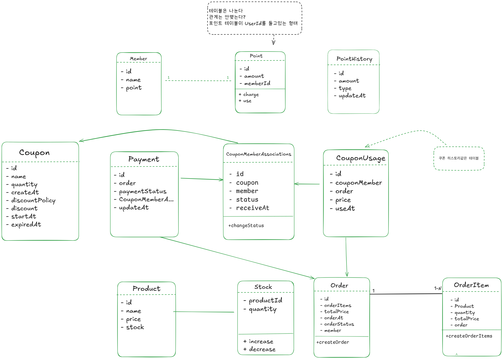

## 클래스 다이어그램
1. Member-Point관계와 Product-Stock의 관계는 동일하게 가져가도 될까요? 
2. 주문과 결제는 같은 트랜잭션에서 이루어져야 할까요?
3. 쿠폰과 멤버를 매핑 테이블로 두고 결제가 이루어질때 CouponUsage 테이블에 쿠폰사용에 대한 내역을 쌓도록 설계하였습니다. 이부분에 대한 피드백 부탁드립니다. 
g)

