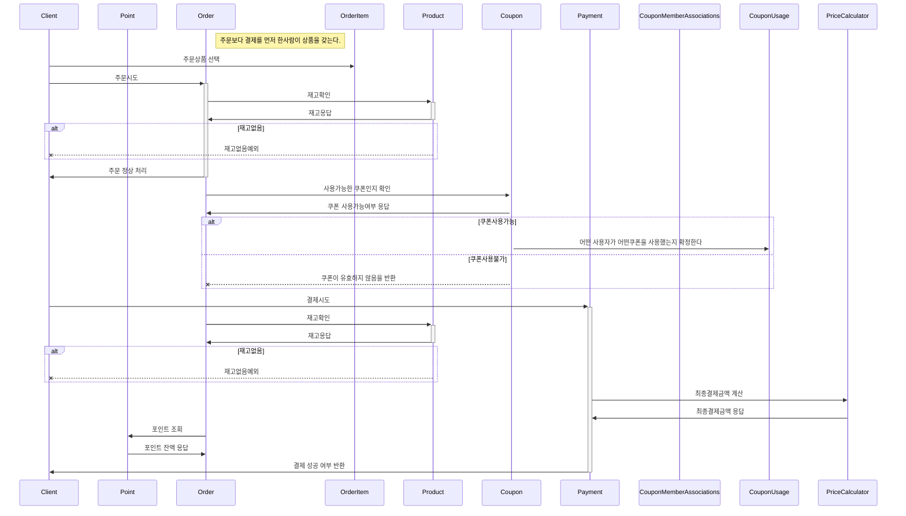

## 시퀀스 다이어그램 

> **고민한 부분**
### 1. 주문과 결제는 주문을 함과 동시에 이루어지나요?
- 만약 A상품의 재고는 10개라고 가정했을때 
- 홍길동이라는 사람이 A상품 8개를 먼저 선택하여 주문 페이지에 들어왔고 
- 김홍식이라는 사람이 늦게 주문페이지에 들어왔지만 A상품 5개를 홍길동보다 빨리 결제를 시작했을때 김홍식이는 결제를 할 수 있나요? 상품에 대한 우선권이 누구에게 있는지 궁금합니다.
```
다른 예시 - 한국사 시험
- A학생이 파랑초등학교에서 치루게되는 한국사 시험을 온라인으로 신청하려한다.
- 파랑초등학교에 신청가능한 자리수는 한자리다. 
 - A학생은 자리를 먼저 선택하였다.
 - B학생은 A학생보다 늦게 자리를 선택했지만 결제를 더 빨리했다. 
 
 - 누구에게 시험 자리를 줘야하는지 궁금합니다.
```

### 2. 도메인을 객체로하여 다이어그램을 그리다보니 어려움을 겪었습니다.
- 도메인에게 책임을 할당하는것이 어렵게 느껴집니다.
- 예를 들어 쿠폰 사용 가능 여부를 확인하는 책임은 Coupon이 가져야 하는건지 Order가 가져야하는 것인지  궁금합니다.
- OrderService 레이어에서 쿠폰 사용여부를 가져올 것 같은데 이럴경우 그림처럼 Order에서 Coupon으로 향하게 하는 것이 맞는지 
- 서비스 레이어에서 실행되어야할 로직은 도메인 시퀀스 다이어그램에서 어떻게 표시해야하는지 모르겠습니다.



