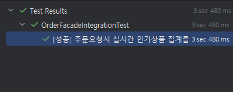
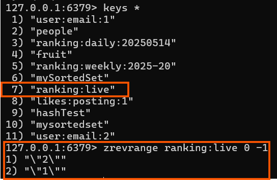
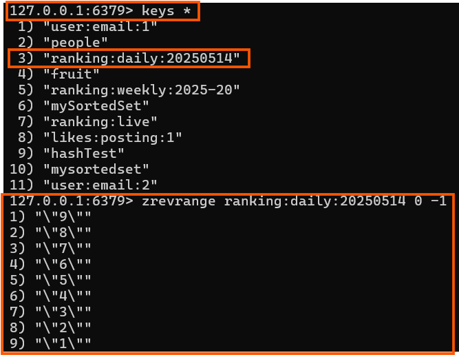
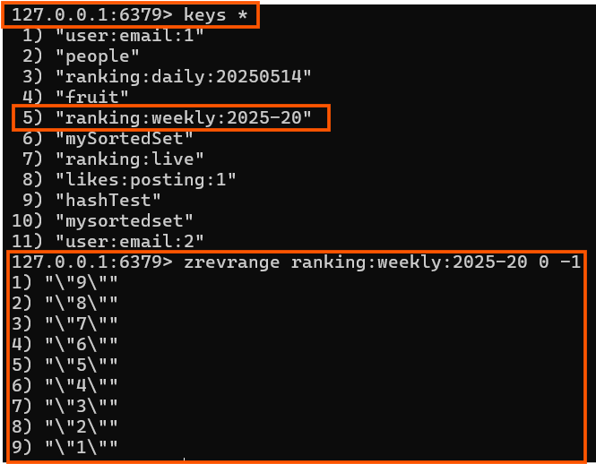

# 레디스로 인기상품 조회 개발하기

---

## 🎯 목표

1. **실시간 랭킹**
  - **요구사항**
    - 주문이 완료되면 비동기 이벤트를 발생시켜  
      `productId`와 `수량`을 Redis Sorted Set에 반영
    - 인기상품 조회 시 해당 Sorted Set을 바로 읽어옴
  - **TTL**: 24시간 (24h)
  - **키 전략**

    | 구분        | 키                   | 설명                         |
    | ----------- | -------------------- | ---------------------------- |
    | 실시간 랭킹 | `ranking:live`       | 마지막 24시간 누적 집계     |

---

2. **일간 인기상품 조회**
  - **요구사항**
    - 00:00 ~ 23:50까지의 주문 통계를 집계
    - 매일 23:50에 배치로 캐시에 적재 (pre-warm)
    - 클라이언트는 캐시만 조회하도록 유도
  - **TTL**: 25시간
  - **키 전략**
    ```text
    ranking:daily:{YYYYMMDD}
    // 예) ranking:daily:20250514
    ```

  - **스케줄 예시**
    ```java
    @Scheduled(cron = "0 50 23 * * *", zone = "Asia/Seoul")
    public void warmDailyRanking() {
        // 일간 집계 로직 → Redis에 set
    }
    ```

---

3. **주간 인기상품 조회**
  - **요구사항**
    - 최근 7일간(집계일 포함)의 주문 통계를 집계
    - 매일 23:50에 배치로 캐시에 적재
    - ISO 주 단위(‘2025-20주차’ 등)로 구분
  - **TTL**: 25시
  - **키 전략**
    ```text
    ranking:weekly:{YYYY}-{WW}
    // 예) ranking:weekly:2025-20
    ```

  - **스케줄 예시**
    ```java
    @Scheduled(cron = "0 50 23 * * *", zone = "Asia/Seoul")
    public void warmWeeklyRanking() {
        // 주간 집계 로직 → Redis에 set
    }
    ```

---

## 🔥 Cache Stampede 방지

- **사전 예열(Pre-warming)**
  - 클라이언트 요청 시 DB 조회를 방지
  - 배치 타이밍에 맞춰 캐시 갱신
- **TTL 전략**
  - 일간/주간은 집계 주기 + 1일 여유
  - 실시간 랭킹은 24시간 누적

---

## 📈 요약

| 구분            | 집계 주기              | 키 예시                         | 배치 스케줄               | TTL    |
| --------------- | ---------------------- | ------------------------------ | ------------------------- | ------ |
| **실시간 랭킹** | 실시간(이벤트 발생 시) | `ranking:live`                 | —                         | 24h    |
| **일간 랭킹**   | 00:00~23:50            | `ranking:daily:20250514`       | 매일 23:50 (`cron`)       | 25h    |
| **주간 랭킹**   | 최근 7일                | `ranking:weekly:2025-20`       | 매일 23:50 (`cron`)       | 25h    |


```java
// 예: 매일 23시 50분에 실행
@Scheduled(cron = "0 50 23 * * *", zone = "Asia/Seoul")
public void warmRankingCaches() { … }
```
---

# 코드구현
## 1. 실시간 랭킹 구현하기
OrderFacade에서 주문을 성공하면 이벤트를 발생하여 커밋 후에 레디스에 상품에 대한 판매개수를 저장할수 있도록 처리한다. publish 를 호출하면 TransactionalEventListener가 커밋이후에 실행된다.
```java
	@Transactional
	public OrderResult.Order order(OrderCriteria.CreateOrder criteria) {
		// 재고 조회
		// 쿠폰 사용
		// 주문 생성
		// 주문
	    // 포인트 차감
        // 결재완료

		publisher.publishEvent(new OrderCompletedEvent(criteria.getOrderItems()));
		return result;
	}
```

이벤트는 `@TransactionalEventListener`로 받아 실시간 주문내역에 대해 레디스에 저장할 수 있다.
```java
public class RankingUpdater {

	private final RedisRepository redisRepository;

	@TransactionalEventListener(phase = TransactionPhase.AFTER_COMMIT)
	public void handleOrderCompleted(OrderCompletedEvent event) {
		String LIVE_RANK_KEY = "ranking:live";

		for (OrderCriteria.OrderItem item : event.getItems()) {
			redisRepository.incrSortedSet(LIVE_RANK_KEY, String.valueOf(item.getProductId()), item.getQuantity(), Duration.ofDays(1));
		}
	}
}
```
## 2. 일간/주간 주문내역 집계하여 인기상품 적재하기
```java

public class BestItemScheduler {

	private static final DateTimeFormatter DAILY_FORMAT = DateTimeFormatter.BASIC_ISO_DATE;
	private static final DateTimeFormatter WEEKLY_FORMAT = DateTimeFormatter.ofPattern("YYYY-ww");
	public static final String DAILY_KEY_PREFIX = "ranking:daily:";
	public static final String WEEK_KEY_PREFIX = "ranking:weekly:";

	// 일간 인기랭킹
	@Scheduled(cron = "0 50 23 * * *")
	@Transactional
	public void warmDailyRanking() {
		List<OrderItem> OrderOneDayStats = orderService.getOrderBeforeHour(24);

		Map<Long, Long> salesOneDayMap = getSalesMap(OrderOneDayStats);

		salesOneDayMap.forEach((productId, salesQuantity) -> {
			Product product = productService.findById(productId);
			String dailyKey = DAILY_KEY_PREFIX + LocalDate.now().format(DAILY_FORMAT);
			redisRepository.addSortedSetWithTTL(dailyKey, String.valueOf(product.getId()), salesQuantity, Duration.ofHours(25));
		});
	}

	// 주간 인기랭킹
	@Scheduled(cron = "0 50 23 * * *")
	@Transactional
	public void warmWeeklyRanking() {
		List<OrderItem> orderOneWeekStats = orderService.getOrderBeforeDay(7);

		Map<Long, Long> salesOneWeekMap = getSalesMap(orderOneWeekStats);

		salesOneWeekMap.forEach((productId, salesQuantity) -> {
			Product product = productService.findById(productId);
			String weekKey = WEEK_KEY_PREFIX + LocalDate.now().format(WEEKLY_FORMAT);
			redisRepository.addSortedSetWithTTL(weekKey, String.valueOf(product.getId()), salesQuantity, Duration.ofHours(25));
		});
	}


	private static Map<Long, Long> getSalesMap(List<OrderItem> OrderOneDayStats) {
		return OrderOneDayStats.stream().collect(Collectors.groupingBy(
			OrderItem::getProductId,
			Collectors.summingLong(OrderItem::getQuantity)
		));
	}
}
```

## 3. 실시간/일간/주간 인기상품 레디스로 조회하기
```java
@Transactional
public Set<Object> getTop10LiveRank() {
    log.info("실시간 인기상품조회");
    String LIVE_RANK_KEY = "ranking:live";
    return redisRepository.getSoretedSetReverseRange(LIVE_RANK_KEY,10);
}

@Transactional
public Set<Object> getTop10DailyRank() {
    log.info("일간 인기상품 조회");
    String DAILY_KEY_PREFIX = "ranking:daily:";
    String dailyKey = DAILY_KEY_PREFIX + LocalDate.now().format(DAILY_FORMAT);
    return redisRepository.getSoretedSetReverseRange(dailyKey,10);
}

@Transactional
public Set<Object> getTop10WeeklyRank() {
    log.info("주간 인기상품 조회");
    String WEEK_KEY_PREFIX = "ranking:weekly:";
    String weekKey = WEEK_KEY_PREFIX + LocalDate.now().format(WEEKLY_FORMAT);
    return  redisRepository.getSoretedSetReverseRange(weekKey,10);
}
```

---
# 테스트
## 1. 실시간 랭킹
```java
@Test
@DisplayName("[성공] 주문요청시 실시간 인기상품 집계를 위해 데이터가 저장된다.")
void concurrency_order_success() {
    // given
    // 사용자 생성
    // 포인트 생성
    // 상품 생성
    Product product1 = Product.create("스테이크", 10_000L);
    Product product2 = Product.create("수박", 10_000L);
    productRepository.save(product1);
    productRepository.save(product2);
    
    // 상품 재고 생성
    // product1을 10개 주문
    OrderCriteria.OrderItem orderItem1 = OrderCriteria.OrderItem.of(product1.getId(), 10);
    
    // product2을 20개 주문
    OrderCriteria.OrderItem orderItem2 = OrderCriteria.OrderItem.of(product2.getId(), 20);
    
    // 주문정보 생성
    OrderCriteria.CreateOrder orderCriteria = OrderCriteria.CreateOrder.of(user.getId(),null, List.of(orderItem1,orderItem2));
    
    // when
    OrderResult.Order ordered = orderFacade.order(orderCriteria);
    
    // then
    String LIVE_RANK_KEY = "ranking:live";
    Set<Object> result = redisRepository.reverseRange(LIVE_RANK_KEY, 0L, 10L);
    
    assertThat(result).extracting(o -> ((String)o)).containsExactly(String.valueOf(product2.getId()),String.valueOf(product1.getId()));
    }
```

#### 테스트 결과 


#### 레디스에서 데이터 확인


## 2. 일간 랭킹
```java
@Test
@DisplayName("일간 인기상품을 레디스 캐시에서 조회한다.")
void get_daily_rank_item() {

    // given
    // 1번 상품 10개, 2번상품 20개....9번상품 90개..
    String dailyKey = DAILY_KEY_PREFIX + LocalDate.now().format(DAILY_FORMAT);
    IntStream.range(1,10).forEach((i) -> {
        redisRepository.addSortedSetWithTTL(dailyKey,String.valueOf(i),i*10, Duration.ofHours(25));
    });

    // when
    bestItemScheduler.warmDailyRanking();
    
    // then
    Set<Object> result = bestItemService.getTop10DailyRank();
    assertThat(result).extracting(o -> ((String)o)).containsExactly("9", "8", "7", "6", "5", "4", "3", "2", "1");
}
```
#### 테스트 결과




## 3. 주간 랭킹
일간 랭킹과 테스트 방식은 동일

#### 테스트 결과
