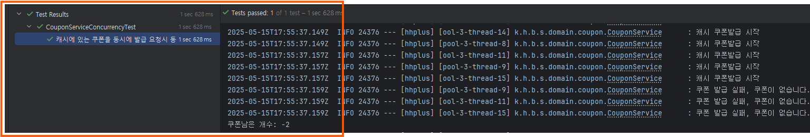
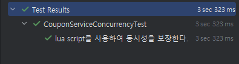

# 쿠폰발급 레디스로 개발하기
## 발급 프로세스
선착순 쿠폰을 발급하면서 동시에 중복발급을 방지하는 기능까지 구현해보려고 한다. 
쿠폰 발급은 사용자가 쿠폰받기 버튼을 누르면 개수가 차감되고, 쿠폰을 받은 사용자는 쿠폰아이디와 사용자 아이디가 UserCoupon 테이블에 저장되어 추적할 수 있다.

> 쿠폰 생성 -> 쿠폰요청 -> 쿠폰발급 -> 발급받은 사용자인지 검사 -> 쿠폰발급 -> 쿠폰개수 차감 -> 발급데이터 저장
> 
## 1. String 단순 개수기로 쿠폰발급
먼저 쿠폰발급의 가장 간단한 방법이라고 생각되는 단순 개수기로 쿠폰발급을 구현해보면서 문제점을 알아보고 개선해 나간다.

쿠폰을 발급하기 위해서는 먼저 쿠폰을 생성한다. DB에 저장된 쿠폰은 선착순 발급을 위해 레디스에 적재한다.
```java
public void loadFcFsCoupon(Long couponId) {
    Coupon coupon = couponRepository.findCouponById(couponId).orElseThrow(() -> new GlobalBusinessException(ErrorCode.NOT_FOUND_COUPON));//RDB
    
    String couponKey = "coupon:" + coupon.getId() + ":remaining";
    redisRepository.sSet(couponKey, String.valueOf(coupon.getQuantity()));
    redisRepository.expire(couponKey, Duration.ofHours(1));
}
```
sSet은 Strings에 저장하는 메소드로, 쿠폰아이디와 개수를 저장한다. ttl은 한시간으로 설정한다.

```java
@Transactional
public void issueCouponWithRedisCounter(UserCouponCommand.Issue command) {
    String couponKey = "coupon:" + command.getCouponId() + ":remaining";
    String issuedKey = "coupon:" + command.getCouponId() + ":issued";

    Long added = redisRepository.addSet(issuedKey, String.valueOf(command.getUserId()));

    if(added == 0) {
        log.info("쿠폰 발급 실패, 이미 발급된 쿠폰입니다.");
        return;
    }

    if(Integer.parseInt(redisRepository.sGet(couponKey)) <= 0) {
        log.info("쿠폰 발급 실패, 쿠폰이 없습니다.");
        return;
    }

    redisRepository.sDecr(couponKey);
    // 비동기 이벤트로 UserCoupon 데이터 저장
}
```
redis set에 발급된 쿠폰을 저장하고, 이미 발급받은 유저라면 return한다. 그리고 쿠폰개수가 0이되면 return한다.

### 동시성 문제
레디스는 단일스레드이지만 자바는 멀티스레드 이므로 동시 발급시 `if(Integer.parseInt(redisRepository.sGet(couponKey)) <= 0) {`에서 문제가 발생할 수 있다.  

#### 테스트
```java
@Test
@DisplayName("캐시에 있는 쿠폰을 동시에 발급 요청시 동시성 이슈가 발생한다.")
void issue_coupon_with_redis_duplicate() throws InterruptedException {

    // given
    int threadCount = 15;
    ExecutorService executorService = Executors.newFixedThreadPool(threadCount);
    CountDownLatch latch = new CountDownLatch(threadCount);
    CountDownLatch startLatch = new CountDownLatch(1);

    List<Long> userIds = createUsers(15);
    CouponCommand.Create command = CouponCommand.Create.of(
        "깜짝쿠폰",
        1000L,
        10,
        CouponType.LIMITED,
        startDate,
        endDate
    );

    CouponInfo.Coupon savedCoupon = couponService.register(command);
    couponService.loadFcFsCoupon(savedCoupon.getId());

    // when
    for (int i = 0; i < threadCount; i++) {
        Long userId = userIds.get(i);
        executorService.submit(() -> {
            try{
                startLatch.await();
                UserCouponCommand.Issue issue = UserCouponCommand.Issue.of(savedCoupon.getId(), userId);
                couponService.issueCouponWithRedisCounter(issue);
            } catch (InterruptedException e) {
                Thread.currentThread().interrupt();
            } finally {
                latch.countDown();
            }
        });
    }

    startLatch.countDown();
    latch.await();
    executorService.shutdown();

    // then
    String couponKey = "coupon:" + savedCoupon.getId() + ":remaining";
    String count = redisRepository.sGet(couponKey);
		
    assertThat(count).isLessThan(String.valueOf(0));
}
```
#### 테스트 결과

쿠폰이 10개인 하나인 상황에서 15명의 사용자가 동시에 요청시 2명이 위의 유효성검사를 통과하게 되고 쿠폰 개수는 -2가 되어버린다. 이런 문제를 해결하기 위해 여러가지 방법이 있다.

```bash
1. lua script로 atomic하게 처리하기
2. 레디스의 분산락을 사용하기
3. 업데이트하지않고 배치로 처리하기
4. sorted set활용하여 비즈니스 로직으로 해결
```

### lua script로 atomic하게 처리하기

```java
// Lua 스크립트를 resources에 두고 읽어올 수도 있습니다.
private static final String ISSUE_LUA =
    "if redis.call('SISMEMBER', KEYS[2], ARGV[1]) == 1 then return -1 end\n" +
    "local remain = tonumber(redis.call('GET', KEYS[1]) or '0')\n" +
    "if remain <= 0 then return 0 end\n" +
    "redis.call('DECR', KEYS[1])\n" +
    "redis.call('SADD', KEYS[2], ARGV[1])\n" +
    "return 1";

@Transactional
public void issueCouponWithLuaScript(UserCouponCommand.Issue command) {
    String remKey   = "coupon:" + command.getCouponId() + ":remaining";
    String issuedKey= "coupon:" + command.getCouponId() + ":issued";
    
    DefaultRedisScript<Long> script = new DefaultRedisScript<>();
    script.setScriptText(ISSUE_LUA);
    script.setResultType(Long.class);
    
    Long result = redisRepository.execute(
        script,
        List.of(remKey, issuedKey),
        String.valueOf(command.getUserId())
    );
    ...
}
```

Lua 스크립트 원본
```lua
-- KEYS[1] = remaining key (coupon:{id}:remaining)
-- KEYS[2] = issued   key (coupon:{id}:issued)
-- ARGV[1] = userId

-- 1) 이미 발급됐는지 검사
if redis.call('SISMEMBER', KEYS[2], ARGV[1]) == 1 then
return -1    -- 리턴값 -1: 이미 발급된 유저
end

-- 2) 남은 쿠폰 수량을 가져와 숫자로 변환
local remain = tonumber(redis.call('GET', KEYS[1]) or '0')
if remain <= 0 then
return 0     -- 리턴값  0: 재고 없음
end

-- 3) 재고 차감
redis.call('DECR', KEYS[1])

-- 4) 발급 이력 기록 (중복 방지 Set에 추가)
redis.call('SADD', KEYS[2], ARGV[1])

-- 5) 성공 리턴
return 1       -- 리턴값  1: 발급 성공
```
#### 테스트
```java
@Test
@DisplayName("lua script를 사용하여 동시성을 보장한다.")
void issue_coupon_with_lua() throws InterruptedException {

    // given
    int threadCount = 15;
    CountDownLatch latch = new CountDownLatch(threadCount);
    CountDownLatch startLatch = new CountDownLatch(1);

    List<Long> userIds = createUsers(15);
    CouponCommand.Create command = 쿠폰10장생성();

    CouponInfo.Coupon savedCoupon = couponService.register(command);
    couponService.loadFcFsCoupon(savedCoupon.getId());

    // when
    for (int i = 0; i < threadCount; i++) {
        Long userId = userIds.get(i);
        executorService.submit(() -> {
            try{
                UserCouponCommand.Issue issue = UserCouponCommand.Issue.of(savedCoupon.getId(), userId);
                startLatch.await();
                couponService.issueCouponWithLuaScript(issue);
            } catch (InterruptedException e) {
                Thread.currentThread().interrupt();
            } finally {
                latch.countDown();
            }
        });
    }

    startLatch.countDown();
    latch.await();
    executorService.shutdown();

    // then
    String couponKey = "coupon:" + savedCoupon.getId() + ":remaining";
    String count = redisRepository.sGet(couponKey);
    assertThat(count).isEqualTo(String.valueOf(0));
}
```
#### 테스트 결과


### Sorted Set 활용하기 
100개의 쿠폰을 발급한다고 가정했을때, sorted set을 활용하여 발급 받는 유저에게 요청한 순서대로 score를 적용한다.  
이후 100개가 발급되었을때 sorted set을 내림차순으로 조회하여 100명에게 쿠폰을 발급한다.

### 결론
- 쿠폰 발급 로직은 표면상 단순해 보이나, 대량의 동시 요청이 몰릴 때 시스템의 안정성과 데이터 일관성을 지키는 것이 쉽지 않음을 깨달았다.

- 처음에는 Redis의 DECR 기반 단순 카운터로 접근했으나, 레이스 컨디션과 Redis–DB 불일치 문제가 발생하여 한계에 직면했다.

- 중복 발급 방지를 위해 Set 자료구조를 도입하고, Redis Lua 스크립트로 체크–차감 과정을 원자적으로 묶음으로써 중복 발급을 완벽히 방지할 수 있었다.

- Redis의 문자열(String), 집합(Set), 스크립트(Lua) 등 다양한 기능을 직접 활용해 보며, 각 자료구조의 장단점을 몸소 체험했다.

- “성능을 위해서는 트레이드 오프가 존재하는 것 같다”는 교훈을 얻었다.
> 이번 과제를 통해 레디스에 대해 전반적으로 알아보았다. 앞으로는 레디스의 클러스터 구성 및 백업을 직접 구현해보면서 레디스를 더 깊이 이해하고 활용해보아야겠다.


